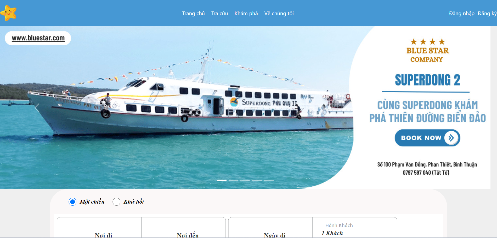
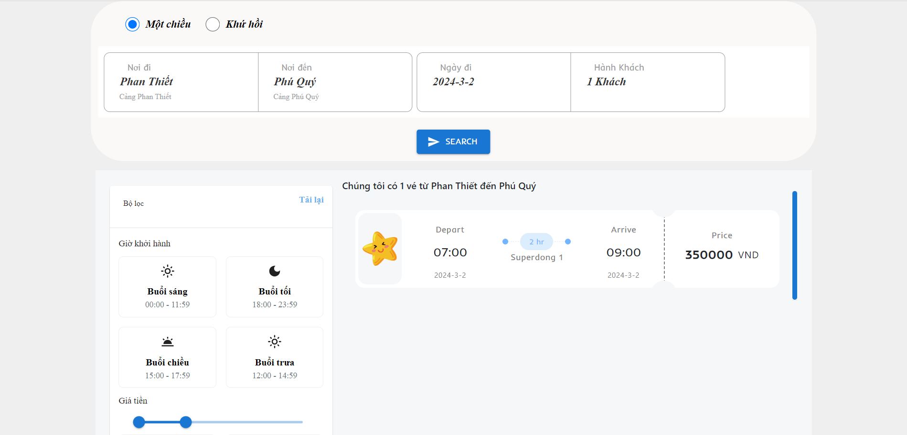
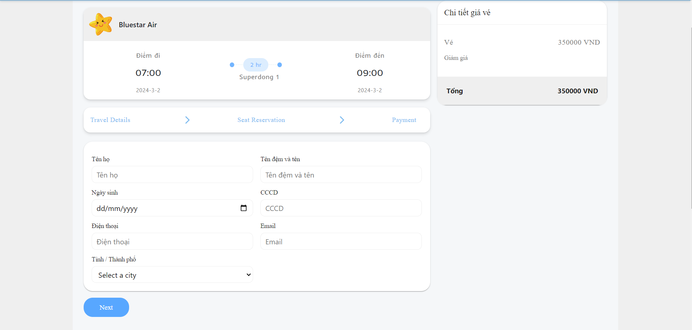
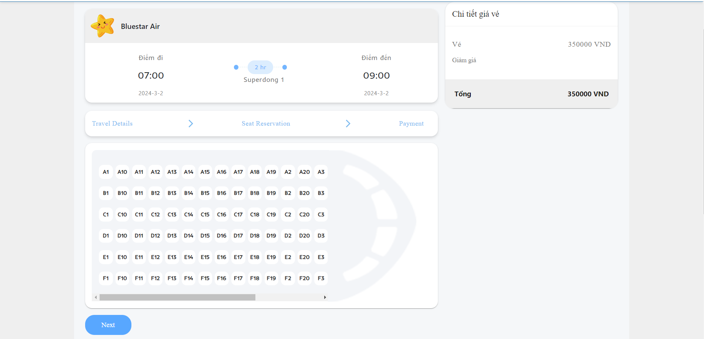
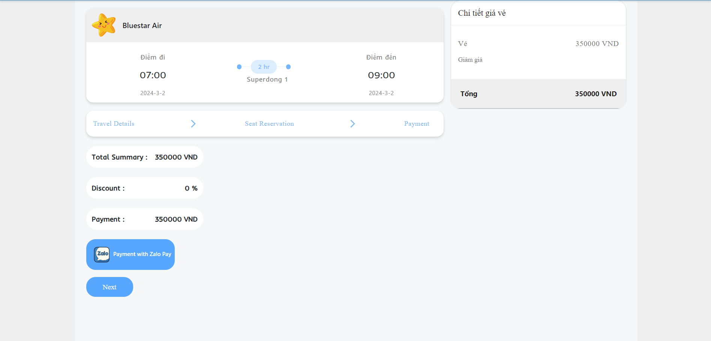

# Java Technology Final Project
## Using React For Fronted And Spring Boot API For Backend
### Website interface
#### Home Page

### Ticket Booking Process
#### Step 1

#### Step 2

#### Step 3

#### Step 4

// For connect the database
```properties
spring.datasource.url=jdbc:mysql://localhost:3306/boatbooking
spring.datasource.username=root
spring.datasource.password=123456
spring.jpa.properties.hibernate.dialect=org.hibernate.dialect.MySQLDialect
spring.jpa.hibernate.ddl-auto=update

```
